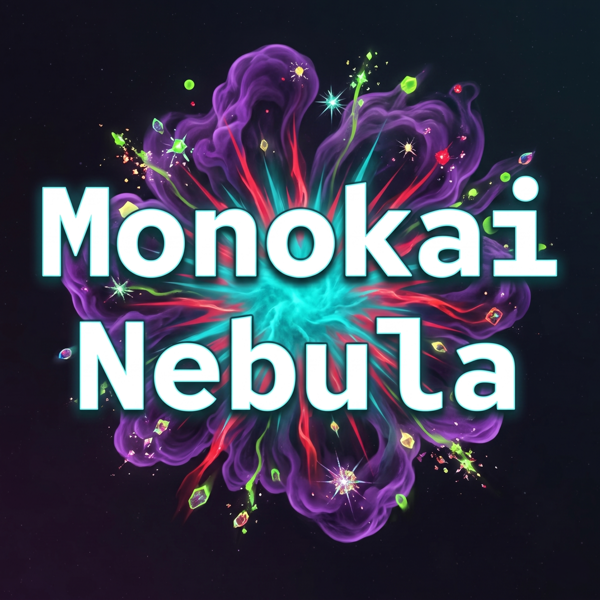
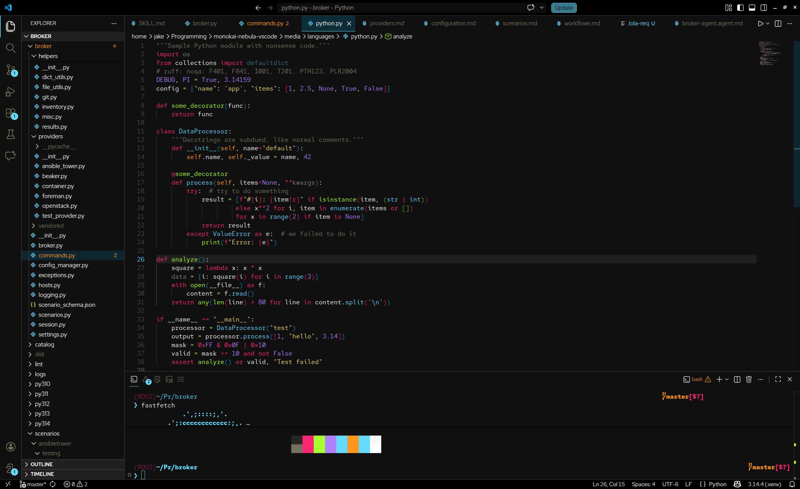

[](https://marketplace.visualstudio.com/items?itemName=jacobcallahan.monokai-nebula)
[](https://marketplace.visualstudio.com/items?itemName=jacobcallahan.monokai-nebula)

**Monokai Nebula** is a deep and vivid Monokai-inspired theme for Visual Studio Code.

My goal is to improve contrast over many other Monokai themes, while enhancing the overall beauty and readability of text.

This theme provides custom colors for almost every themeable element in the editor, giving way to default values where a more "native" feel is appropriate.

Bright colors over a dark (but not black) background make it easier to read.
Unlike other Monokai themes, Nebula treats docstrings like regular comments, reducing visual noise.

And for those that prefer a light theme, choose **Monokai Nebula Light** — it brightens things up while keeping strong contrast for a "silky" feel.

## Install

**Via Marketplace:** Search for `Monokai Nebula` in the VS Code Extensions view, or install directly from the [VS Code Marketplace](https://marketplace.visualstudio.com/items?itemName=jacobcallahan.monokai-nebula).

**Via VSIX:** Download the latest `.vsix` from the [Releases](https://github.com/JacobCallahan/monokai-nebula-vscode/releases) page and run:
```
code --install-extension monokai-nebula-*.vsix
```

## Preview


